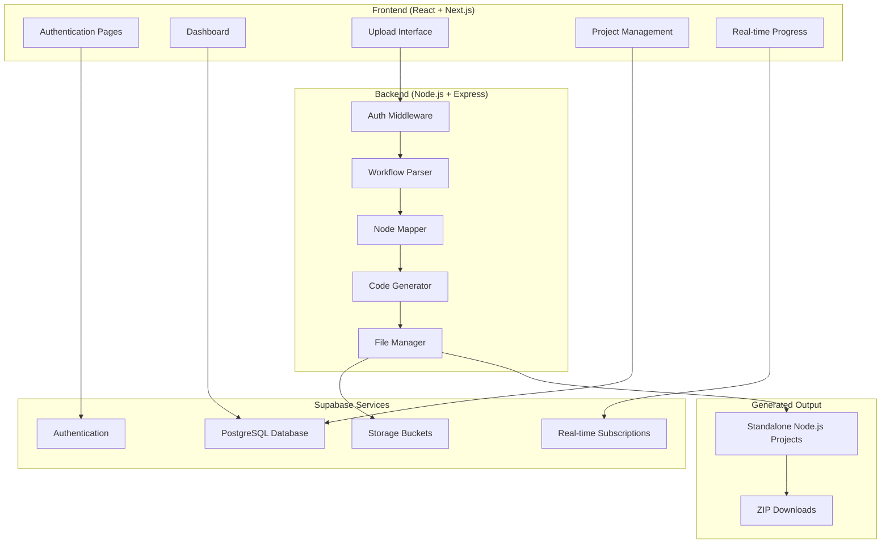

# Design Document

## Overview

The n8n Workflow to Standalone Codebase Converter is a full-stack web application that transforms n8n workflow JSON exports into standalone Node.js projects. The system leverages Supabase for authentication, data persistence, real-time updates, and file storage, while maintaining the core functionality of parsing workflows and generating executable code.

## Architecture

### High-Level Architecture



### System Components

1. **Frontend Application**: React/Next.js with Tailwind CSS
2. **Backend API**: Node.js/Express with Supabase integration
3. **Database**: Supabase PostgreSQL for user data and project metadata
4. **File Storage**: Supabase Storage for workflow files and generated projects
5. **Real-time Engine**: Supabase real-time subscriptions for live updates
6. **Authentication**: Supabase Auth with email/OAuth providers

## Components and Interfaces

### Frontend Components

#### Authentication System
- **Login/Register Pages**: Email/password and OAuth (Google, GitHub)
- **Protected Routes**: Route guards using Supabase Auth
- **User Profile**: Account management and settings

#### Dashboard Interface
- **Project Overview**: Grid/list view of user's conversions
- **Analytics Panel**: Usage statistics and insights
- **Quick Actions**: Upload new workflow, access recent projects

#### Workflow Upload & Management
- **File Upload**: Drag-and-drop with validation
- **Workflow Preview**: Display parsed workflow information
- **Project Configuration**: Environment variables and settings

#### Real-time Progress Tracking
- **Progress Bar**: Visual indication of generation status
- **Live Logs**: Streaming console output during generation
- **Status Updates**: Real-time notifications via Supabase subscriptions

### Backend Services

#### Authentication Middleware
```javascript
// Verify Supabase JWT tokens
const authMiddleware = async (req, res, next) => {
  const token = req.headers.authorization?.replace('Bearer ', '');
  const { data: user, error } = await supabase.auth.getUser(token);
  if (error) return res.status(401).json({ error: 'Unauthorized' });
  req.user = user;
  next();
};
```

#### Workflow Parser Service
```javascript
class WorkflowParser {
  async parseWorkflow(jsonData, userId) {
    // Validate JSON structure
    // Extract nodes, triggers, connections
    // Store workflow metadata in Supabase
    // Return parsed workflow object
  }
}
```

#### Node Mapper Service
```javascript
class NodeMapper {
  async mapNodes(workflow) {
    // Map each node to n8n package implementation
    // Generate import statements
    // Create node execution modules
    // Return mapped node configurations
  }
}
```

#### Code Generator Service
```javascript
class CodeGenerator {
  async generateProject(workflow, mappedNodes, userId) {
    // Create project structure
    // Generate Node.js files
    // Update generation progress in real-time
    // Store generated files in Supabase Storage
    // Return project metadata
  }
}
```

#### Security Scanning Service (Edge Function)
```javascript
// Edge Function for VirusTotal integration
import { serve } from 'https://deno.land/std@0.168.0/http/server.ts'

serve(async (req) => {
  const { fileData, fileName } = await req.json()
  
  // Scan file with VirusTotal API
  const scanResult = await fetch('https://www.virustotal.com/vtapi/v2/file/scan', {
    method: 'POST',
    headers: {
      'apikey': Deno.env.get('VIRUSTOTAL_KEY')
    },
    body: new FormData().append('file', fileData)
  })
  
  const result = await scanResult.json()
  
  // Return security status
  return new Response(JSON.stringify({
    safe: result.positives === 0,
    scanId: result.scan_id,
    permalink: result.permalink
  }))
})
```

## Data Models

### Supabase Database Schema

#### Users Table (handled by Supabase Auth)
```sql
-- Automatically managed by Supabase Auth
-- Additional user profile data can be stored in a profiles table
```

#### Profiles Table
```sql
CREATE TABLE profiles (
  id UUID REFERENCES auth.users(id) PRIMARY KEY,
  email TEXT,
  full_name TEXT,
  avatar_url TEXT,
  created_at TIMESTAMP WITH TIME ZONE DEFAULT NOW(),
  updated_at TIMESTAMP WITH TIME ZONE DEFAULT NOW()
);
```

#### Projects Table
```sql
CREATE TABLE projects (
  id UUID DEFAULT gen_random_uuid() PRIMARY KEY,
  user_id UUID REFERENCES auth.users(id) NOT NULL,
  name TEXT NOT NULL,
  description TEXT,
  workflow_json JSONB NOT NULL,
  status TEXT CHECK (status IN ('pending', 'processing', 'completed', 'failed')) DEFAULT 'pending',
  node_count INTEGER,
  trigger_count INTEGER,
  generated_at TIMESTAMP WITH TIME ZONE,
  file_path TEXT, -- Path in Supabase Storage
  created_at TIMESTAMP WITH TIME ZONE DEFAULT NOW(),
  updated_at TIMESTAMP WITH TIME ZONE DEFAULT NOW()
);
```

#### Project_Analytics Table
```sql
CREATE TABLE project_analytics (
  id UUID DEFAULT gen_random_uuid() PRIMARY KEY,
  project_id UUID REFERENCES projects(id) NOT NULL,
  generation_time_ms INTEGER,
  file_size_bytes BIGINT,
  node_types JSONB, -- Array of node types used
  complexity_score INTEGER,
  created_at TIMESTAMP WITH TIME ZONE DEFAULT NOW()
);
```

#### Generation_Logs Table
```sql
CREATE TABLE generation_logs (
  id UUID DEFAULT gen_random_uuid() PRIMARY KEY,
  project_id UUID REFERENCES projects(id) NOT NULL,
  log_level TEXT CHECK (log_level IN ('info', 'warning', 'error')) NOT NULL,
  message TEXT NOT NULL,
  timestamp TIMESTAMP WITH TIME ZONE DEFAULT NOW()
);
```

#### Shared_Projects Table
```sql
CREATE TABLE shared_projects (
  id UUID DEFAULT gen_random_uuid() PRIMARY KEY,
  project_id UUID REFERENCES projects(id) NOT NULL,
  shared_by UUID REFERENCES auth.users(id) NOT NULL,
  shared_with UUID REFERENCES auth.users(id),
  share_token TEXT UNIQUE, -- For public sharing
  permissions TEXT CHECK (permissions IN ('read', 'write')) DEFAULT 'read',
  expires_at TIMESTAMP WITH TIME ZONE,
  created_at TIMESTAMP WITH TIME ZONE DEFAULT NOW()
);
```

### Supabase Storage Buckets

#### Workflow Files Bucket
- **Name**: `workflow-files`
- **Purpose**: Store original n8n JSON files
- **Path Structure**: `{user_id}/{project_id}/workflow.json`

#### Generated Projects Bucket
- **Name**: `generated-projects`
- **Purpose**: Store generated Node.js project files
- **Path Structure**: `{user_id}/{project_id}/project.zip`

## Error Handling

### Frontend Error Handling
```javascript
// Global error boundary for React components
class ErrorBoundary extends React.Component {
  constructor(props) {
    super(props);
    this.state = { hasError: false, error: null };
  }

  static getDerivedStateFromError(error) {
    return { hasError: true, error };
  }

  componentDidCatch(error, errorInfo) {
    // Log error to Supabase or external service
    console.error('Application error:', error, errorInfo);
  }
}

// API error handling with user-friendly messages
const handleApiError = (error) => {
  const userMessage = error.response?.data?.message || 'An unexpected error occurred';
  toast.error(userMessage);
  
  // Log detailed error for debugging
  console.error('API Error:', error);
};
```

### Backend Error Handling
```javascript
// Global error handler middleware
const errorHandler = (err, req, res, next) => {
  console.error('Server error:', err);
  
  // Log error to Supabase
  supabase.from('error_logs').insert({
    user_id: req.user?.id,
    error_message: err.message,
    stack_trace: err.stack,
    request_path: req.path,
    request_method: req.method
  });

  const statusCode = err.statusCode || 500;
  const message = err.message || 'Internal server error';
  
  res.status(statusCode).json({
    error: message,
    ...(process.env.NODE_ENV === 'development' && { stack: err.stack })
  });
};
```

### Workflow Generation Error Handling
```javascript
class GenerationErrorHandler {
  static async handleNodeMappingError(nodeType, projectId) {
    await supabase.from('generation_logs').insert({
      project_id: projectId,
      log_level: 'warning',
      message: `Unsupported node type: ${nodeType}. Skipping node.`
    });
  }

  static async handleCodeGenerationError(error, projectId) {
    await supabase.from('generation_logs').insert({
      project_id: projectId,
      log_level: 'error',
      message: `Code generation failed: ${error.message}`
    });
    
    // Update project status
    await supabase.from('projects')
      .update({ status: 'failed' })
      .eq('id', projectId);
  }
}
```

## Testing Strategy

### Unit Testing
- **Frontend**: Jest + React Testing Library for component testing
- **Backend**: Jest + Supertest for API endpoint testing
- **Services**: Mock Supabase client for isolated service testing

### Integration Testing
- **Database**: Test Supabase queries and real-time subscriptions
- **File Storage**: Test file upload/download operations
- **Authentication**: Test auth flows and protected routes

### End-to-End Testing
- **Playwright/Cypress**: Full user journey testing
- **Workflow Conversion**: Test complete workflow from upload to download
- **Real-time Features**: Test live progress updates and notifications

### Test Data Management
```javascript
// Test utilities for Supabase
class TestUtils {
  static async createTestUser() {
    const { data, error } = await supabase.auth.signUp({
      email: 'test@example.com',
      password: 'testpassword123'
    });
    return data.user;
  }

  static async cleanupTestData(userId) {
    // Clean up test projects, logs, and files
    await supabase.from('projects').delete().eq('user_id', userId);
    await supabase.from('generation_logs').delete().eq('user_id', userId);
  }
}
```

## Security Considerations

### Authentication & Authorization
- **JWT Validation**: Verify Supabase tokens on all protected endpoints
- **Row Level Security**: Implement RLS policies in Supabase
- **Role-based Access**: Different permissions for users and admins

### Data Protection
- **Input Validation**: Sanitize all user inputs to prevent injection attacks
- **File Upload Security**: Validate file types and scan for malicious content using VirusTotal API
- **Malware Scanning**: Scan all uploaded files through VirusTotal before processing
- **Environment Variables**: Secure storage of API keys and secrets in Edge Function environment

### Supabase Security Policies
```sql
-- Projects RLS Policy
CREATE POLICY "Users can only access their own projects" ON projects
  FOR ALL USING (auth.uid() = user_id);

-- Shared Projects RLS Policy  
CREATE POLICY "Users can access shared projects" ON shared_projects
  FOR SELECT USING (
    auth.uid() = shared_by OR 
    auth.uid() = shared_with OR
    share_token IS NOT NULL
  );

-- Generation Logs RLS Policy
CREATE POLICY "Users can only see logs for their projects" ON generation_logs
  FOR SELECT USING (
    project_id IN (
      SELECT id FROM projects WHERE user_id = auth.uid()
    )
  );
```

## Performance Optimization

### Frontend Performance
- **Code Splitting**: Lazy load components and routes
- **Caching**: Cache API responses and user data
- **Optimistic Updates**: Update UI before API confirmation
- **Virtual Scrolling**: Handle large lists of projects efficiently

### Backend Performance
- **Database Indexing**: Optimize queries with proper indexes
- **Connection Pooling**: Efficient database connection management
- **Caching Layer**: Redis for frequently accessed data
- **Background Jobs**: Queue heavy operations like code generation

### Real-time Optimization
```javascript
// Efficient real-time subscriptions
const subscribeToProjectUpdates = (projectId, callback) => {
  return supabase
    .channel(`project-${projectId}`)
    .on('postgres_changes', {
      event: 'UPDATE',
      schema: 'public',
      table: 'projects',
      filter: `id=eq.${projectId}`
    }, callback)
    .subscribe();
};
```

## Deployment Architecture

### Environment Configuration
```javascript
// Environment variables
const config = {
  supabase: {
    url: process.env.NEXT_PUBLIC_SUPABASE_URL,
    anonKey: process.env.NEXT_PUBLIC_SUPABASE_ANON_KEY,
    serviceKey: process.env.SUPABASE_SERVICE_ROLE_KEY
  },
  app: {
    port: process.env.PORT || 3000,
    nodeEnv: process.env.NODE_ENV || 'development'
  }
};
```

### Production Considerations
- **CDN**: Serve static assets via CDN
- **Load Balancing**: Multiple backend instances
- **Monitoring**: Application performance monitoring
- **Backup Strategy**: Regular database and file backups
- **SSL/TLS**: Secure all communications

This design provides a comprehensive foundation for building a robust, scalable n8n workflow converter with modern web technologies and Supabase integration.