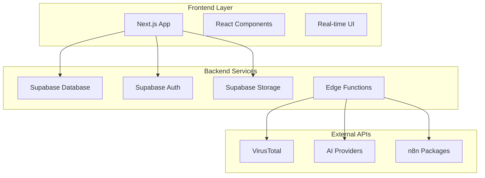

# n8n Workflow to Standalone Codebase Converter

A comprehensive web application that converts n8n workflows (exported as JSON) into fully functional, standalone Node.js projects that can execute without requiring the n8n runtime. Built with modern web technologies and enterprise-grade security.

## ⚡ Quick Start

Get up and running in 2 minutes:

```bash
# Clone the repository
git clone <repository-url>
cd n8n-workflow-converter

# One-command deployment
npm run quick-deploy:start
```

That's it! The app will be running at `http://localhost:3000`

For production deployment, see our [Quick Deployment Guide](./docs/QUICK-DEPLOYMENT.md).

## 🚀 Features

### Core Functionality
- **Workflow Conversion**: Convert n8n JSON exports to standalone Node.js projects
- **Real-time Progress**: Live updates during code generation with detailed logs
- **Project Management**: Organize, search, and manage your converted workflows
- **File Management**: Secure upload, storage, and download of workflows and generated code

### Security & Compliance
- **VirusTotal Integration**: Automatic malware scanning of uploaded files
- **User Authentication**: Secure accounts with email/password and OAuth (Google, GitHub)
- **Data Protection**: Encryption at rest, GDPR compliance, and privacy controls
- **Input Validation**: Comprehensive sanitization and validation of all user inputs

### Analytics & Insights
- **Usage Analytics**: Track conversion metrics, success rates, and performance
- **Workflow Analysis**: Complexity scoring and optimization recommendations
- **Real-time Monitoring**: Live progress tracking and error reporting

### Developer Experience
- **AI Provider Integration**: Support for OpenAI, Anthropic, and Google AI
- **Source-Aware Generation**: Leverages official n8n source code for accurate conversions
- **Comprehensive Testing**: Unit, integration, and end-to-end test coverage
- **Extensive Documentation**: Complete guides for users and developers

## 🏗️ Architecture

### Tech Stack
- **Frontend**: Next.js 15, React 19, TypeScript, Tailwind CSS
- **Backend**: Supabase (PostgreSQL, Auth, Storage, Real-time, Edge Functions)
- **Security**: VirusTotal API, Row Level Security, JWT authentication
- **AI Integration**: OpenAI, Anthropic, Google AI APIs
- **Development**: ESLint, Prettier, Jest, Playwright

### System Components


## 📚 Documentation

### User Documentation
- **[User Guide](./docs/USER-GUIDE.md)** - Complete guide for end users
- **[Tutorials](./docs/TUTORIALS.md)** - Step-by-step tutorials and examples
- **[API Documentation](./docs/API-DOCUMENTATION.md)** - REST API and Edge Functions reference

### Developer Documentation
- **[Developer Guide](./docs/DEVELOPER-GUIDE.md)** - Setup, architecture, and contribution guidelines
- **[Security Documentation](./docs/SECURITY.md)** - Security practices and compliance
- **[Deployment Guide](./docs/DEPLOYMENT.md)** - Production deployment instructions

### Technical Documentation
- **[Configuration Guide](./docs/CONFIGURATION.md)** - Environment and system configuration
- **[Testing Guide](./docs/TESTING.md)** - Testing strategies and implementation
- **[AI Provider Setup](./docs/AI-PROVIDER-CONFIGURATION.md)** - AI service configuration

## 🚀 Quick Start

### Prerequisites
- **Node.js**: Version 20 or higher
- **npm**: Version 9 or higher
- **Supabase Account**: For backend services
- **VirusTotal API Key**: For file security scanning (optional but recommended)

### Installation

1. **Clone the repository**
```bash
git clone https://github.com/your-org/n8n-workflow-converter.git
cd n8n-workflow-converter
```

2. **Install dependencies**
```bash
npm install
```

3. **Environment setup**
```bash
cp .env.example .env.local
```

4. **Configure environment variables**
```bash
# Required - Supabase Configuration
NEXT_PUBLIC_SUPABASE_URL=https://your-project.supabase.co
NEXT_PUBLIC_SUPABASE_ANON_KEY=your-anon-key
SUPABASE_SERVICE_ROLE_KEY=your-service-role-key

# Required - Security
NEXTAUTH_SECRET=your-32-character-secret

# Optional - Enhanced Security
VIRUSTOTAL_API_KEY=your-virustotal-api-key

# Optional - AI Providers
OPENAI_API_KEY=your-openai-key
ANTHROPIC_API_KEY=your-anthropic-key
GOOGLE_AI_API_KEY=your-google-ai-key
```

5. **Database setup**
```bash
# Install Supabase CLI
npm install -g supabase

# Link to your project
supabase link --project-ref your-project-ref

# Run migrations
supabase db push

# Deploy Edge Functions
supabase functions deploy
```

6. **Start development server**
```bash
npm run dev
```

Visit [http://localhost:3000](http://localhost:3000) to see the application.

## 🛠️ Available Scripts

### Development
- `npm run dev` - Start development server with hot reload
- `npm run build` - Build optimized production bundle
- `npm run start` - Start production server
- `npm run type-check` - Run TypeScript type checking

### Code Quality
- `npm run lint` - Run ESLint code analysis
- `npm run lint:fix` - Auto-fix ESLint issues
- `npm run format` - Format code with Prettier
- `npm run format:check` - Check code formatting

### Testing
- `npm test` - Run unit tests
- `npm run test:watch` - Run tests in watch mode
- `npm run test:coverage` - Generate test coverage report
- `npm run test:e2e` - Run end-to-end tests

### Database & Deployment
- `npm run db:generate-types` - Generate TypeScript types from Supabase
- `npm run db:reset` - Reset local database
- `npm run deploy` - Deploy to production

## 📁 Project Structure

```
├── docs/                    # Documentation
├── public/                  # Static assets
├── src/
│   ├── app/                # Next.js App Router pages and API routes
│   │   ├── api/           # REST API endpoints
│   │   ├── (auth)/        # Authentication pages
│   │   └── dashboard/     # Dashboard pages
│   ├── components/         # React components
│   │   ├── ui/           # Base UI components
│   │   ├── dashboard/    # Dashboard-specific components
│   │   ├── auth/         # Authentication components
│   │   └── shared/       # Shared components
│   ├── hooks/             # Custom React hooks
│   ├── lib/               # Utility libraries and services
│   │   ├── supabase/     # Supabase client and utilities
│   │   ├── auth/         # Authentication logic
│   │   ├── security/     # Security utilities
│   │   └── workflow-parsing/ # Workflow processing logic
│   ├── types/             # TypeScript type definitions
│   └── middleware.ts      # Next.js middleware
├── supabase/              # Supabase configuration
│   ├── functions/         # Edge Functions
│   └── migrations/        # Database migrations
└── tests/                 # Test files
```

## 🔒 Security Features

- **File Security**: VirusTotal integration for malware detection
- **Authentication**: Multi-factor authentication support
- **Data Protection**: Encryption at rest and in transit
- **Input Validation**: Comprehensive sanitization and validation
- **Rate Limiting**: API protection against abuse
- **Audit Logging**: Complete security event tracking
- **Privacy Controls**: GDPR compliance and data export capabilities

## 🤝 Contributing

We welcome contributions! Please see our [Developer Guide](./docs/DEVELOPER-GUIDE.md) for detailed information on:

- Development setup and workflow
- Code standards and best practices
- Testing requirements
- Pull request process

### Quick Contribution Steps

1. Fork the repository
2. Create a feature branch: `git checkout -b feature/your-feature-name`
3. Make your changes and add tests
4. Run the test suite: `npm test`
5. Commit your changes: `git commit -m "feat: add new feature"`
6. Push to your fork: `git push origin feature/your-feature-name`
7. Create a Pull Request

## 📄 License

This project is licensed under the MIT License - see the [LICENSE](./LICENSE) file for details.

## 🙏 Attribution

This project leverages the official n8n packages and maintains compatibility with n8n workflows. We extend our gratitude to:

- **[n8n](https://n8n.io/)** - For the excellent automation platform and open-source packages
- **[Supabase](https://supabase.com/)** - For the comprehensive backend-as-a-service platform
- **[Vercel](https://vercel.com/)** - For the Next.js framework and deployment platform
- **All contributors** - For their valuable contributions to this project

### n8n Package Attribution

This project uses the following n8n packages under their respective licenses:
- `n8n-core` - Core n8n functionality
- `n8n-workflow` - Workflow execution engine
- `n8n-nodes-base` - Standard node implementations

For complete license information, see our [License Documentation](./docs/LICENSE-ATTRIBUTION.md).

## 📞 Support

- **Documentation**: Check our comprehensive [documentation](./docs/)
- **Issues**: Report bugs or request features via [GitHub Issues](https://github.com/your-org/n8n-workflow-converter/issues)
- **Discussions**: Join community discussions in [GitHub Discussions](https://github.com/your-org/n8n-workflow-converter/discussions)
- **Security**: Report security issues to security@yourcompany.com

## 🗺️ Roadmap

- [ ] **Enhanced AI Integration**: Support for more AI providers and models
- [ ] **Advanced Workflow Features**: Support for complex n8n workflows and custom nodes
- [ ] **Collaboration Tools**: Team workspaces and shared project management
- [ ] **Performance Optimization**: Faster generation and improved scalability
- [ ] **Mobile App**: Native mobile application for workflow management
- [ ] **Enterprise Features**: SSO, advanced analytics, and compliance tools

---

**Made with ❤️ by the n8n Workflow Converter team**
