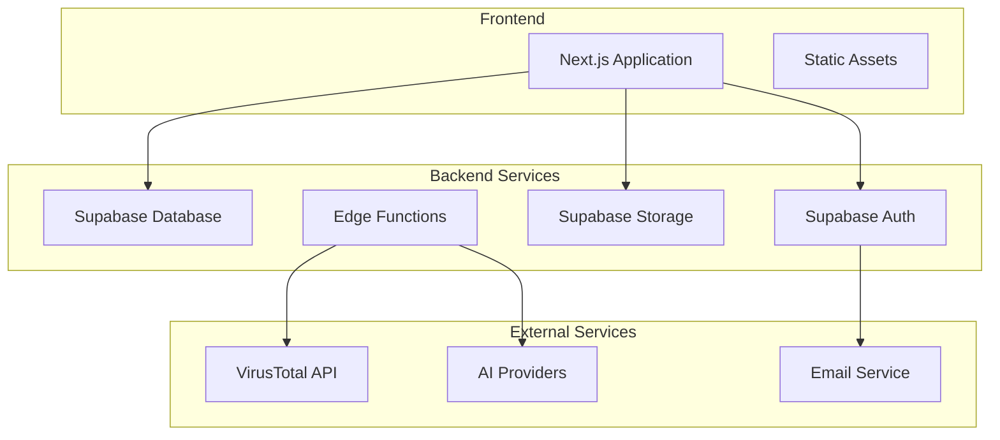

# Deployment Guide

## Table of Contents

1. [Deployment Overview](#deployment-overview)
2. [Environment Setup](#environment-setup)
3. [Supabase Configuration](#supabase-configuration)
4. [Production Deployment](#production-deployment)
5. [Docker Deployment](#docker-deployment)
6. [Cloud Platform Deployment](#cloud-platform-deployment)
7. [Self-Hosting](#self-hosting)
8. [Monitoring & Maintenance](#monitoring--maintenance)
9. [Troubleshooting](#troubleshooting)

## Deployment Overview

The n8n Workflow Converter can be deployed in multiple ways depending on your requirements:

- **Vercel/Netlify**: Serverless deployment (recommended for most users)
- **Docker**: Containerized deployment for any platform
- **Cloud Platforms**: AWS, GCP, Azure with managed services
- **Self-Hosted**: On-premises or VPS deployment

### Architecture Components



## Environment Setup

### Required Environment Variables

Create a `.env.production` file with the following variables:

```bash
# Supabase Configuration
NEXT_PUBLIC_SUPABASE_URL=https://your-project.supabase.co
NEXT_PUBLIC_SUPABASE_ANON_KEY=your-anon-key
SUPABASE_SERVICE_ROLE_KEY=your-service-role-key

# Security
NEXTAUTH_SECRET=your-32-character-secret
NEXTAUTH_URL=https://your-domain.com

# VirusTotal (Optional but recommended)
VIRUSTOTAL_API_KEY=your-virustotal-api-key

# AI Providers (Optional)
OPENAI_API_KEY=your-openai-key
ANTHROPIC_API_KEY=your-anthropic-key
GOOGLE_AI_API_KEY=your-google-ai-key

# Application Settings
NODE_ENV=production
```

### Environment Variable Security

```typescript
// lib/config/env-validation.ts
import { z } from 'zod'

const ProductionEnvSchema = z.object({
  NEXT_PUBLIC_SUPABASE_URL: z.string().url(),
  NEXT_PUBLIC_SUPABASE_ANON_KEY: z.string().min(1),
  SUPABASE_SERVICE_ROLE_KEY: z.string().min(1),
  NEXTAUTH_SECRET: z.string().min(32),
  NEXTAUTH_URL: z.string().url(),
  VIRUSTOTAL_API_KEY: z.string().optional(),
  NODE_ENV: z.literal('production')
})

export function validateProductionEnv() {
  const result = ProductionEnvSchema.safeParse(process.env)
  
  if (!result.success) {
    console.error('❌ Invalid environment configuration:')
    result.error.issues.forEach(issue => {
      console.error(`  ${issue.path.join('.')}: ${issue.message}`)
    })
    process.exit(1)
  }
  
  console.log('✅ Environment configuration validated')
  return result.data
}
```

## Supabase Configuration

### Database Setup

1. **Create Supabase Project**
```bash
# Using Supabase CLI
supabase projects create n8n-workflow-converter --org your-org
```

2. **Run Database Migrations**
```bash
# Apply all migrations
supabase db push

# Or apply specific migration
supabase migration up --target 20240101000000
```

3. **Configure Row Level Security**
```sql
-- Enable RLS on all tables
ALTER TABLE profiles ENABLE ROW LEVEL SECURITY;
ALTER TABLE projects ENABLE ROW LEVEL SECURITY;
ALTER TABLE generation_logs ENABLE ROW LEVEL SECURITY;
ALTER TABLE project_analytics ENABLE ROW LEVEL SECURITY;

-- Create security policies (already defined in migrations)
```

### Storage Configuration

```sql
-- Create storage buckets
INSERT INTO storage.buckets (id, name, public) VALUES 
  ('workflow-files', 'workflow-files', false),
  ('generated-projects', 'generated-projects', false);

-- Set up bucket policies
CREATE POLICY "Users can upload their own files" ON storage.objects
  FOR INSERT WITH CHECK (auth.uid()::text = (storage.foldername(name))[1]);

CREATE POLICY "Users can view their own files" ON storage.objects
  FOR SELECT USING (auth.uid()::text = (storage.foldername(name))[1]);
```

### Edge Functions Deployment

```bash
# Deploy all Edge Functions
supabase functions deploy

# Deploy specific function
supabase functions deploy parse-workflow

# Set function secrets
supabase secrets set VIRUSTOTAL_API_KEY=your-key
supabase secrets set OPENAI_API_KEY=your-key
```

## Production Deployment

### Build Optimization

```bash
# Install dependencies
npm ci --only=production

# Build application
npm run build

# Analyze bundle (optional)
npm run analyze
```

### Next.js Configuration

```typescript
// next.config.ts
const nextConfig = {
  // Enable compression
  compress: true,
  
  // Optimize images
  images: {
    domains: ['your-supabase-project.supabase.co'],
    formats: ['image/webp', 'image/avif']
  },
  
  // Security headers
  async headers() {
    return [
      {
        source: '/(.*)',
        headers: [
          {
            key: 'X-Frame-Options',
            value: 'DENY'
          },
          {
            key: 'X-Content-Type-Options',
            value: 'nosniff'
          },
          {
            key: 'Referrer-Policy',
            value: 'strict-origin-when-cross-origin'
          },
          {
            key: 'Strict-Transport-Security',
            value: 'max-age=31536000; includeSubDomains'
          }
        ]
      }
    ]
  },
  
  // Redirects
  async redirects() {
    return [
      {
        source: '/home',
        destination: '/',
        permanent: true
      }
    ]
  }
}

export default nextConfig
```

## Docker Deployment

### Dockerfile

```dockerfile
# Multi-stage build for optimization
FROM node:20-alpine AS base

# Install dependencies only when needed
FROM base AS deps
RUN apk add --no-cache libc6-compat
WORKDIR /app

# Copy package files
COPY package.json package-lock.json* ./
RUN npm ci --only=production && npm cache clean --force

# Rebuild the source code only when needed
FROM base AS builder
WORKDIR /app
COPY --from=deps /app/node_modules ./node_modules
COPY . .

# Build application
ENV NEXT_TELEMETRY_DISABLED 1
RUN npm run build

# Production image
FROM base AS runner
WORKDIR /app

ENV NODE_ENV production
ENV NEXT_TELEMETRY_DISABLED 1

# Create non-root user
RUN addgroup --system --gid 1001 nodejs
RUN adduser --system --uid 1001 nextjs

# Copy built application
COPY --from=builder /app/public ./public
COPY --from=builder --chown=nextjs:nodejs /app/.next/standalone ./
COPY --from=builder --chown=nextjs:nodejs /app/.next/static ./.next/static

USER nextjs

EXPOSE 3000

ENV PORT 3000
ENV HOSTNAME "0.0.0.0"

# Health check
HEALTHCHECK --interval=30s --timeout=3s --start-period=5s --retries=3 \
  CMD curl -f http://localhost:3000/api/health || exit 1

CMD ["node", "server.js"]
```

### Docker Compose

```yaml
version: '3.8'

services:
  app:
    build: .
    ports:
      - "3000:3000"
    environment:
      - NODE_ENV=production
      - NEXT_PUBLIC_SUPABASE_URL=${NEXT_PUBLIC_SUPABASE_URL}
      - NEXT_PUBLIC_SUPABASE_ANON_KEY=${NEXT_PUBLIC_SUPABASE_ANON_KEY}
      - SUPABASE_SERVICE_ROLE_KEY=${SUPABASE_SERVICE_ROLE_KEY}
      - NEXTAUTH_SECRET=${NEXTAUTH_SECRET}
      - NEXTAUTH_URL=${NEXTAUTH_URL}
    restart: unless-stopped
    healthcheck:
      test: ["CMD", "curl", "-f", "http://localhost:3000/api/health"]
      interval: 30s
      timeout: 10s
      retries: 3
    
  # Optional: Redis for caching
  redis:
    image: redis:7-alpine
    restart: unless-stopped
    volumes:
      - redis_data:/data
    command: redis-server --appendonly yes

volumes:
  redis_data:
```

### Build and Deploy

```bash
# Build Docker image
docker build -t n8n-workflow-converter .

# Run container
docker run -d \
  --name n8n-converter \
  -p 3000:3000 \
  --env-file .env.production \
  n8n-workflow-converter

# Using Docker Compose
docker-compose up -d
```

## Cloud Platform Deployment

### Vercel Deployment

1. **Install Vercel CLI**
```bash
npm i -g vercel
```

2. **Configure Project**
```json
// vercel.json
{
  "framework": "nextjs",
  "buildCommand": "npm run build",
  "devCommand": "npm run dev",
  "installCommand": "npm install",
  "functions": {
    "app/api/**/*.ts": {
      "maxDuration": 30
    }
  },
  "env": {
    "NEXT_PUBLIC_SUPABASE_URL": "@supabase-url",
    "NEXT_PUBLIC_SUPABASE_ANON_KEY": "@supabase-anon-key",
    "SUPABASE_SERVICE_ROLE_KEY": "@supabase-service-key"
  }
}
```

3. **Deploy**
```bash
# Login to Vercel
vercel login

# Deploy to production
vercel --prod
```

### Netlify Deployment

```toml
# netlify.toml
[build]
  command = "npm run build"
  publish = ".next"

[build.environment]
  NODE_VERSION = "20"

[[redirects]]
  from = "/*"
  to = "/index.html"
  status = 200

[functions]
  node_bundler = "esbuild"
```

### AWS Deployment

#### Using AWS Amplify

```yaml
# amplify.yml
version: 1
frontend:
  phases:
    preBuild:
      commands:
        - npm ci
    build:
      commands:
        - npm run build
  artifacts:
    baseDirectory: .next
    files:
      - '**/*'
  cache:
    paths:
      - node_modules/**/*
```

#### Using AWS ECS

```yaml
# docker-compose.aws.yml
version: '3.8'

services:
  app:
    image: your-ecr-repo/n8n-workflow-converter:latest
    ports:
      - "80:3000"
    environment:
      - NODE_ENV=production
    logging:
      driver: awslogs
      options:
        awslogs-group: /ecs/n8n-converter
        awslogs-region: us-east-1
        awslogs-stream-prefix: ecs
```

### Google Cloud Platform

```yaml
# app.yaml (App Engine)
runtime: nodejs20

env_variables:
  NODE_ENV: production
  NEXT_PUBLIC_SUPABASE_URL: "your-supabase-url"
  NEXT_PUBLIC_SUPABASE_ANON_KEY: "your-anon-key"

automatic_scaling:
  min_instances: 1
  max_instances: 10
  target_cpu_utilization: 0.6
```

## Self-Hosting

### VPS Deployment

1. **Server Setup**
```bash
# Update system
sudo apt update && sudo apt upgrade -y

# Install Node.js
curl -fsSL https://deb.nodesource.com/setup_20.x | sudo -E bash -
sudo apt-get install -y nodejs

# Install PM2 for process management
sudo npm install -g pm2

# Install Nginx
sudo apt install nginx -y
```

2. **Application Deployment**
```bash
# Clone repository
git clone https://github.com/your-org/n8n-workflow-converter.git
cd n8n-workflow-converter

# Install dependencies
npm ci --only=production

# Build application
npm run build

# Start with PM2
pm2 start ecosystem.config.js
pm2 save
pm2 startup
```

3. **PM2 Configuration**
```javascript
// ecosystem.config.js
module.exports = {
  apps: [{
    name: 'n8n-converter',
    script: 'npm',
    args: 'start',
    instances: 'max',
    exec_mode: 'cluster',
    env: {
      NODE_ENV: 'production',
      PORT: 3000
    },
    error_file: './logs/err.log',
    out_file: './logs/out.log',
    log_file: './logs/combined.log',
    time: true
  }]
}
```

4. **Nginx Configuration**
```nginx
# /etc/nginx/sites-available/n8n-converter
server {
    listen 80;
    server_name your-domain.com;
    
    # Redirect HTTP to HTTPS
    return 301 https://$server_name$request_uri;
}

server {
    listen 443 ssl http2;
    server_name your-domain.com;
    
    # SSL Configuration
    ssl_certificate /path/to/your/certificate.crt;
    ssl_certificate_key /path/to/your/private.key;
    ssl_protocols TLSv1.2 TLSv1.3;
    ssl_ciphers ECDHE-RSA-AES256-GCM-SHA512:DHE-RSA-AES256-GCM-SHA512;
    
    # Security headers
    add_header X-Frame-Options "SAMEORIGIN" always;
    add_header X-XSS-Protection "1; mode=block" always;
    add_header X-Content-Type-Options "nosniff" always;
    add_header Referrer-Policy "no-referrer-when-downgrade" always;
    add_header Content-Security-Policy "default-src 'self' http: https: data: blob: 'unsafe-inline'" always;
    
    # Gzip compression
    gzip on;
    gzip_vary on;
    gzip_min_length 1024;
    gzip_types text/plain text/css text/xml text/javascript application/javascript application/xml+rss application/json;
    
    location / {
        proxy_pass http://localhost:3000;
        proxy_http_version 1.1;
        proxy_set_header Upgrade $http_upgrade;
        proxy_set_header Connection 'upgrade';
        proxy_set_header Host $host;
        proxy_set_header X-Real-IP $remote_addr;
        proxy_set_header X-Forwarded-For $proxy_add_x_forwarded_for;
        proxy_set_header X-Forwarded-Proto $scheme;
        proxy_cache_bypass $http_upgrade;
    }
}
```

### SSL Certificate Setup

```bash
# Using Let's Encrypt
sudo apt install certbot python3-certbot-nginx -y

# Obtain certificate
sudo certbot --nginx -d your-domain.com

# Auto-renewal
sudo crontab -e
# Add: 0 12 * * * /usr/bin/certbot renew --quiet
```

## Monitoring & Maintenance

### Health Checks

```typescript
// app/api/health/route.ts
export async function GET() {
  try {
    // Check database connection
    const { data, error } = await supabase
      .from('profiles')
      .select('count')
      .limit(1)
    
    if (error) throw error
    
    // Check external services
    const checks = {
      database: 'healthy',
      timestamp: new Date().toISOString(),
      version: process.env.npm_package_version || 'unknown'
    }
    
    return Response.json(checks)
  } catch (error) {
    return Response.json(
      { status: 'unhealthy', error: error.message },
      { status: 503 }
    )
  }
}
```

### Logging Configuration

```typescript
// lib/monitoring/logger.ts
import winston from 'winston'

export const logger = winston.createLogger({
  level: process.env.LOG_LEVEL || 'info',
  format: winston.format.combine(
    winston.format.timestamp(),
    winston.format.errors({ stack: true }),
    winston.format.json()
  ),
  defaultMeta: { service: 'n8n-converter' },
  transports: [
    new winston.transports.File({ filename: 'logs/error.log', level: 'error' }),
    new winston.transports.File({ filename: 'logs/combined.log' }),
    new winston.transports.Console({
      format: winston.format.simple()
    })
  ]
})
```

### Backup Strategy

```bash
#!/bin/bash
# backup.sh - Database backup script

DATE=$(date +%Y%m%d_%H%M%S)
BACKUP_DIR="/backups"
DB_NAME="your_database"

# Create backup directory
mkdir -p $BACKUP_DIR

# Backup Supabase data (using pg_dump)
pg_dump $DATABASE_URL > $BACKUP_DIR/db_backup_$DATE.sql

# Backup uploaded files
tar -czf $BACKUP_DIR/files_backup_$DATE.tar.gz /path/to/uploaded/files

# Clean old backups (keep last 7 days)
find $BACKUP_DIR -name "*.sql" -mtime +7 -delete
find $BACKUP_DIR -name "*.tar.gz" -mtime +7 -delete

echo "Backup completed: $DATE"
```

### Performance Monitoring

```typescript
// lib/monitoring/performance.ts
export class PerformanceMonitor {
  static async trackApiCall(endpoint: string, duration: number, status: number) {
    await supabase.from('api_metrics').insert({
      endpoint,
      duration_ms: duration,
      status_code: status,
      timestamp: new Date().toISOString()
    })
  }
  
  static async trackWorkflowGeneration(projectId: string, metrics: any) {
    await supabase.from('generation_metrics').insert({
      project_id: projectId,
      generation_time_ms: metrics.duration,
      file_size_bytes: metrics.fileSize,
      node_count: metrics.nodeCount,
      timestamp: new Date().toISOString()
    })
  }
}
```

## Troubleshooting

### Common Issues

#### Build Failures

```bash
# Clear Next.js cache
rm -rf .next

# Clear node_modules
rm -rf node_modules package-lock.json
npm install

# Check Node.js version
node --version  # Should be 20+
```

#### Database Connection Issues

```typescript
// Test Supabase connection
const testConnection = async () => {
  try {
    const { data, error } = await supabase
      .from('profiles')
      .select('count')
      .limit(1)
    
    if (error) {
      console.error('Database connection failed:', error)
    } else {
      console.log('Database connection successful')
    }
  } catch (error) {
    console.error('Connection test failed:', error)
  }
}
```

#### Memory Issues

```bash
# Increase Node.js memory limit
export NODE_OPTIONS="--max-old-space-size=4096"

# Or in package.json
{
  "scripts": {
    "build": "NODE_OPTIONS='--max-old-space-size=4096' next build"
  }
}
```

### Debug Mode

```bash
# Enable debug logging
DEBUG=* npm start

# Next.js debug mode
NODE_ENV=development npm run dev
```

### Log Analysis

```bash
# View application logs
pm2 logs n8n-converter

# View Nginx logs
sudo tail -f /var/log/nginx/access.log
sudo tail -f /var/log/nginx/error.log

# View system logs
journalctl -u nginx -f
```

For additional support, check our [troubleshooting guide](./TROUBLESHOOTING.md) or contact support.