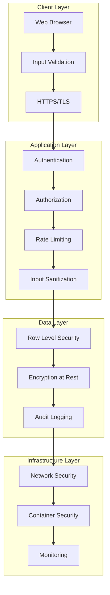

# Security Documentation

## Table of Contents

1. [Security Overview](#security-overview)
2. [Authentication & Authorization](#authentication--authorization)
3. [Input Validation & Sanitization](#input-validation--sanitization)
4. [File Upload Security](#file-upload-security)
5. [Data Protection](#data-protection)
6. [API Security](#api-security)
7. [Infrastructure Security](#infrastructure-security)
8. [Security Monitoring](#security-monitoring)
9. [Incident Response](#incident-response)
10. [Security Best Practices](#security-best-practices)

## Security Overview

The n8n Workflow Converter implements multiple layers of security to protect user data, prevent malicious attacks, and ensure secure workflow processing. Our security model follows the principle of defense in depth.

### Security Architecture



### Security Principles

1. **Zero Trust**: Never trust, always verify
2. **Least Privilege**: Minimal access rights
3. **Defense in Depth**: Multiple security layers
4. **Fail Secure**: Secure defaults and error handling
5. **Privacy by Design**: Data protection built-in

## Authentication & Authorization

### Supabase Authentication

The application uses Supabase Auth for secure user authentication:

```typescript
// lib/auth/auth-service.ts
export class AuthService {
  // Secure password requirements
  static validatePassword(password: string): boolean {
    const minLength = 8
    const hasUpperCase = /[A-Z]/.test(password)
    const hasLowerCase = /[a-z]/.test(password)
    const hasNumbers = /\d/.test(password)
    const hasSpecialChar = /[!@#$%^&*(),.?":{}|<>]/.test(password)
    
    return password.length >= minLength && 
           hasUpperCase && 
           hasLowerCase && 
           hasNumbers && 
           hasSpecialChar
  }
  
  static async signUp(email: string, password: string) {
    if (!this.validatePassword(password)) {
      throw new Error('Password does not meet security requirements')
    }
    
    const { data, error } = await supabase.auth.signUp({
      email,
      password,
      options: {
        emailRedirectTo: `${window.location.origin}/auth/callback`
      }
    })
    
    if (error) throw error
    return data
  }
}
```

### JWT Token Security

```typescript
// middleware.ts - Token validation
import { createMiddlewareClient } from '@supabase/auth-helpers-nextjs'
import { NextResponse } from 'next/server'

export async function middleware(req: NextRequest) {
  const res = NextResponse.next()
  const supabase = createMiddlewareClient({ req, res })
  
  try {
    const { data: { session }, error } = await supabase.auth.getSession()
    
    if (error) {
      console.error('Auth error:', error)
      return NextResponse.redirect(new URL('/login', req.url))
    }
    
    // Validate token expiry
    if (session && session.expires_at) {
      const expiryTime = new Date(session.expires_at * 1000)
      if (expiryTime < new Date()) {
        return NextResponse.redirect(new URL('/login', req.url))
      }
    }
    
    // Protected routes
    if (req.nextUrl.pathname.startsWith('/dashboard') && !session) {
      return NextResponse.redirect(new URL('/login', req.url))
    }
    
    return res
  } catch (error) {
    console.error('Middleware error:', error)
    return NextResponse.redirect(new URL('/login', req.url))
  }
}
```

### Row Level Security (RLS)

Database-level security policies ensure users can only access their own data:

```sql
-- Projects table RLS policy
CREATE POLICY "Users can only access their own projects" ON projects
  FOR ALL USING (auth.uid() = user_id);

-- Shared projects policy
CREATE POLICY "Users can access shared projects" ON shared_projects
  FOR SELECT USING (
    auth.uid() = shared_by OR 
    auth.uid() = shared_with OR
    (share_token IS NOT NULL AND expires_at > NOW())
  );

-- Generation logs policy
CREATE POLICY "Users can only see logs for their projects" ON generation_logs
  FOR SELECT USING (
    project_id IN (
      SELECT id FROM projects WHERE user_id = auth.uid()
    )
  );
```

### Multi-Factor Authentication (MFA)

```typescript
// Enable MFA for enhanced security
export async function enableMFA() {
  const { data, error } = await supabase.auth.mfa.enroll({
    factorType: 'totp',
    friendlyName: 'n8n Converter App'
  })
  
  if (error) throw error
  return data
}

export async function verifyMFA(code: string, challengeId: string) {
  const { data, error } = await supabase.auth.mfa.verify({
    factorId: challengeId,
    challengeId,
    code
  })
  
  if (error) throw error
  return data
}
```

## Input Validation & Sanitization

### Comprehensive Input Validation

```typescript
// lib/security/input-validator.ts
import { z } from 'zod'
import DOMPurify from 'isomorphic-dompurify'

export class InputValidator {
  // Workflow JSON validation schema
  static readonly WorkflowSchema = z.object({
    name: z.string()
      .min(1, 'Name is required')
      .max(100, 'Name too long')
      .regex(/^[a-zA-Z0-9\s\-_]+$/, 'Invalid characters in name'),
    nodes: z.array(z.object({
      name: z.string(),
      type: z.string().regex(/^[a-zA-Z0-9\-_.]+$/, 'Invalid node type'),
      parameters: z.record(z.any())
    })),
    connections: z.record(z.any())
  })
  
  // Sanitize HTML content
  static sanitizeHtml(input: string): string {
    return DOMPurify.sanitize(input, {
      ALLOWED_TAGS: [],
      ALLOWED_ATTR: []
    })
  }
  
  // Validate and sanitize project name
  static validateProjectName(name: string): string {
    const sanitized = this.sanitizeHtml(name.trim())
    
    if (sanitized.length === 0) {
      throw new Error('Project name cannot be empty')
    }
    
    if (sanitized.length > 100) {
      throw new Error('Project name too long')
    }
    
    // Check for SQL injection patterns
    const sqlPatterns = [
      /(\b(SELECT|INSERT|UPDATE|DELETE|DROP|CREATE|ALTER)\b)/i,
      /(UNION|OR|AND)\s+\d+\s*=\s*\d+/i,
      /['"]\s*(OR|AND)\s*['"]/i
    ]
    
    for (const pattern of sqlPatterns) {
      if (pattern.test(sanitized)) {
        throw new Error('Invalid characters detected')
      }
    }
    
    return sanitized
  }
  
  // Validate workflow JSON structure
  static validateWorkflowJson(data: unknown): any {
    try {
      return this.WorkflowSchema.parse(data)
    } catch (error) {
      if (error instanceof z.ZodError) {
        throw new Error(`Invalid workflow structure: ${error.errors[0].message}`)
      }
      throw error
    }
  }
}
```

### API Input Validation

```typescript
// app/api/projects/route.ts
import { InputValidator } from '@/lib/security/input-validator'

export async function POST(request: Request) {
  try {
    const body = await request.json()
    
    // Validate and sanitize inputs
    const validatedData = {
      name: InputValidator.validateProjectName(body.name),
      description: body.description ? 
        InputValidator.sanitizeHtml(body.description) : undefined,
      workflowJson: InputValidator.validateWorkflowJson(body.workflowJson)
    }
    
    // Process validated data...
    
  } catch (error) {
    return NextResponse.json(
      { error: 'Invalid input data' },
      { status: 400 }
    )
  }
}
```

## File Upload Security

### VirusTotal Integration

All uploaded files are scanned for malware using VirusTotal API:

```typescript
// lib/security/virus-scanner.ts
export class VirusScanner {
  private static readonly API_KEY = process.env.VIRUSTOTAL_API_KEY
  private static readonly API_URL = 'https://www.virustotal.com/vtapi/v2'
  
  static async scanFile(fileBuffer: Buffer, fileName: string): Promise<ScanResult> {
    if (!this.API_KEY) {
      console.warn('VirusTotal API key not configured')
      return { safe: true, scanId: null, warning: 'Scan disabled' }
    }
    
    try {
      // Upload file for scanning
      const formData = new FormData()
      formData.append('apikey', this.API_KEY)
      formData.append('file', new Blob([fileBuffer]), fileName)
      
      const response = await fetch(`${this.API_URL}/file/scan`, {
        method: 'POST',
        body: formData
      })
      
      const result = await response.json()
      
      if (result.response_code === 1) {
        // Wait for scan completion
        await this.waitForScanCompletion(result.scan_id)
        
        // Get scan report
        const report = await this.getScanReport(result.scan_id)
        
        return {
          safe: report.positives === 0,
          scanId: result.scan_id,
          positives: report.positives,
          total: report.total,
          permalink: report.permalink
        }
      }
      
      throw new Error('Scan submission failed')
      
    } catch (error) {
      console.error('VirusTotal scan error:', error)
      // Fail secure - reject file if scan fails
      return { safe: false, error: 'Scan failed' }
    }
  }
  
  private static async waitForScanCompletion(scanId: string): Promise<void> {
    const maxAttempts = 30
    const delay = 2000 // 2 seconds
    
    for (let i = 0; i < maxAttempts; i++) {
      const report = await this.getScanReport(scanId)
      
      if (report.response_code === 1) {
        return // Scan complete
      }
      
      await new Promise(resolve => setTimeout(resolve, delay))
    }
    
    throw new Error('Scan timeout')
  }
  
  private static async getScanReport(scanId: string) {
    const response = await fetch(
      `${this.API_URL}/file/report?apikey=${this.API_KEY}&resource=${scanId}`
    )
    
    return await response.json()
  }
}
```

### File Upload Validation

```typescript
// lib/security/file-validator.ts
export class FileValidator {
  private static readonly MAX_FILE_SIZE = 10 * 1024 * 1024 // 10MB
  private static readonly ALLOWED_TYPES = ['application/json']
  private static readonly ALLOWED_EXTENSIONS = ['.json']
  
  static validateFile(file: File): void {
    // Check file size
    if (file.size > this.MAX_FILE_SIZE) {
      throw new Error(`File size exceeds ${this.MAX_FILE_SIZE / 1024 / 1024}MB limit`)
    }
    
    // Check file type
    if (!this.ALLOWED_TYPES.includes(file.type)) {
      throw new Error('Only JSON files are allowed')
    }
    
    // Check file extension
    const extension = file.name.toLowerCase().substring(file.name.lastIndexOf('.'))
    if (!this.ALLOWED_EXTENSIONS.includes(extension)) {
      throw new Error('Invalid file extension')
    }
    
    // Check for suspicious file names
    const suspiciousPatterns = [
      /\.(exe|bat|cmd|scr|pif|com)$/i,
      /\.(php|asp|jsp|js)$/i,
      /[<>:"|?*]/,
      /^\./
    ]
    
    for (const pattern of suspiciousPatterns) {
      if (pattern.test(file.name)) {
        throw new Error('Suspicious file name detected')
      }
    }
  }
  
  static async validateFileContent(buffer: Buffer): Promise<void> {
    try {
      // Attempt to parse as JSON
      const content = buffer.toString('utf8')
      const parsed = JSON.parse(content)
      
      // Check for suspicious content
      const suspiciousKeys = ['eval', 'function', 'script', 'iframe', 'object']
      const contentStr = JSON.stringify(parsed).toLowerCase()
      
      for (const key of suspiciousKeys) {
        if (contentStr.includes(key)) {
          console.warn(`Suspicious content detected: ${key}`)
        }
      }
      
      // Validate n8n workflow structure
      if (!parsed.nodes || !Array.isArray(parsed.nodes)) {
        throw new Error('Invalid n8n workflow structure')
      }
      
    } catch (error) {
      if (error instanceof SyntaxError) {
        throw new Error('Invalid JSON format')
      }
      throw error
    }
  }
}
```

## Data Protection

### Encryption at Rest

Sensitive data is encrypted using AES-256 encryption:

```typescript
// lib/security/encryption.ts
import crypto from 'crypto'

export class EncryptionService {
  private static readonly ALGORITHM = 'aes-256-gcm'
  private static readonly KEY_LENGTH = 32
  private static readonly IV_LENGTH = 16
  
  static encrypt(text: string, key: string): EncryptedData {
    const keyBuffer = crypto.scryptSync(key, 'salt', this.KEY_LENGTH)
    const iv = crypto.randomBytes(this.IV_LENGTH)
    
    const cipher = crypto.createCipher(this.ALGORITHM, keyBuffer, iv)
    
    let encrypted = cipher.update(text, 'utf8', 'hex')
    encrypted += cipher.final('hex')
    
    const authTag = cipher.getAuthTag()
    
    return {
      encrypted,
      iv: iv.toString('hex'),
      authTag: authTag.toString('hex')
    }
  }
  
  static decrypt(encryptedData: EncryptedData, key: string): string {
    const keyBuffer = crypto.scryptSync(key, 'salt', this.KEY_LENGTH)
    const iv = Buffer.from(encryptedData.iv, 'hex')
    const authTag = Buffer.from(encryptedData.authTag, 'hex')
    
    const decipher = crypto.createDecipher(this.ALGORITHM, keyBuffer, iv)
    decipher.setAuthTag(authTag)
    
    let decrypted = decipher.update(encryptedData.encrypted, 'hex', 'utf8')
    decrypted += decipher.final('utf8')
    
    return decrypted
  }
}
```

### API Key Management

```typescript
// supabase/functions/encrypt-api-key/index.ts
import { serve } from 'https://deno.land/std@0.168.0/http/server.ts'
import { createClient } from 'https://esm.sh/@supabase/supabase-js@2'

serve(async (req) => {
  try {
    const { apiKey, provider } = await req.json()
    
    // Validate API key format
    if (!apiKey || typeof apiKey !== 'string') {
      throw new Error('Invalid API key')
    }
    
    // Encrypt API key
    const encryptionKey = Deno.env.get('ENCRYPTION_KEY')
    if (!encryptionKey) {
      throw new Error('Encryption key not configured')
    }
    
    const encrypted = await encryptApiKey(apiKey, encryptionKey)
    
    return new Response(JSON.stringify({
      success: true,
      encryptedKey: encrypted
    }), {
      headers: { 'Content-Type': 'application/json' }
    })
    
  } catch (error) {
    return new Response(JSON.stringify({
      success: false,
      error: error.message
    }), {
      status: 400,
      headers: { 'Content-Type': 'application/json' }
    })
  }
})
```

### Data Anonymization

```typescript
// lib/security/data-anonymizer.ts
export class DataAnonymizer {
  static anonymizeEmail(email: string): string {
    const [local, domain] = email.split('@')
    const anonymizedLocal = local.charAt(0) + '*'.repeat(local.length - 2) + local.charAt(local.length - 1)
    return `${anonymizedLocal}@${domain}`
  }
  
  static anonymizeWorkflowData(workflow: any): any {
    const anonymized = JSON.parse(JSON.stringify(workflow))
    
    // Remove sensitive parameters
    const sensitiveKeys = ['password', 'token', 'key', 'secret', 'credential']
    
    function removeSensitiveData(obj: any) {
      for (const key in obj) {
        if (typeof obj[key] === 'object' && obj[key] !== null) {
          removeSensitiveData(obj[key])
        } else if (sensitiveKeys.some(sensitive => key.toLowerCase().includes(sensitive))) {
          obj[key] = '[REDACTED]'
        }
      }
    }
    
    removeSensitiveData(anonymized)
    return anonymized
  }
}
```

## API Security

### Rate Limiting

```typescript
// lib/security/rate-limiter.ts
import { Redis } from 'ioredis'

export class RateLimiter {
  private static redis = new Redis(process.env.REDIS_URL)
  
  static async checkLimit(
    identifier: string,
    limit: number,
    windowMs: number
  ): Promise<{ allowed: boolean; remaining: number; resetTime: number }> {
    const key = `rate_limit:${identifier}`
    const now = Date.now()
    const window = Math.floor(now / windowMs)
    const windowKey = `${key}:${window}`
    
    const current = await this.redis.incr(windowKey)
    
    if (current === 1) {
      await this.redis.expire(windowKey, Math.ceil(windowMs / 1000))
    }
    
    const allowed = current <= limit
    const remaining = Math.max(0, limit - current)
    const resetTime = (window + 1) * windowMs
    
    return { allowed, remaining, resetTime }
  }
}

// Usage in API routes
export async function POST(request: Request) {
  const ip = request.headers.get('x-forwarded-for') || 'unknown'
  const { allowed, remaining, resetTime } = await RateLimiter.checkLimit(
    ip,
    100, // 100 requests
    60 * 1000 // per minute
  )
  
  if (!allowed) {
    return NextResponse.json(
      { error: 'Rate limit exceeded' },
      { 
        status: 429,
        headers: {
          'X-RateLimit-Limit': '100',
          'X-RateLimit-Remaining': remaining.toString(),
          'X-RateLimit-Reset': resetTime.toString()
        }
      }
    )
  }
  
  // Process request...
}
```

### CORS Configuration

```typescript
// next.config.ts
const nextConfig = {
  async headers() {
    return [
      {
        source: '/api/:path*',
        headers: [
          {
            key: 'Access-Control-Allow-Origin',
            value: process.env.NODE_ENV === 'production' 
              ? 'https://yourdomain.com' 
              : 'http://localhost:3000'
          },
          {
            key: 'Access-Control-Allow-Methods',
            value: 'GET, POST, PUT, DELETE, OPTIONS'
          },
          {
            key: 'Access-Control-Allow-Headers',
            value: 'Content-Type, Authorization'
          },
          {
            key: 'X-Content-Type-Options',
            value: 'nosniff'
          },
          {
            key: 'X-Frame-Options',
            value: 'DENY'
          },
          {
            key: 'X-XSS-Protection',
            value: '1; mode=block'
          }
        ]
      }
    ]
  }
}
```

## Infrastructure Security

### Environment Variables Security

```typescript
// lib/config/env-validator.ts
import { z } from 'zod'

const EnvSchema = z.object({
  // Required environment variables
  NEXT_PUBLIC_SUPABASE_URL: z.string().url(),
  NEXT_PUBLIC_SUPABASE_ANON_KEY: z.string().min(1),
  SUPABASE_SERVICE_ROLE_KEY: z.string().min(1),
  
  // Optional but recommended
  VIRUSTOTAL_API_KEY: z.string().optional(),
  ENCRYPTION_KEY: z.string().min(32).optional(),
  
  // Security settings
  NEXTAUTH_SECRET: z.string().min(32),
  NEXTAUTH_URL: z.string().url().optional()
})

export function validateEnvironment() {
  try {
    return EnvSchema.parse(process.env)
  } catch (error) {
    console.error('Environment validation failed:', error)
    process.exit(1)
  }
}
```

### Docker Security

```dockerfile
# Use specific version tags
FROM node:20.10.0-alpine

# Create non-root user
RUN addgroup -g 1001 -S nodejs
RUN adduser -S nextjs -u 1001

# Set working directory
WORKDIR /app

# Copy package files
COPY package*.json ./

# Install dependencies as root
RUN npm ci --only=production && npm cache clean --force

# Copy application code
COPY --chown=nextjs:nodejs . .

# Switch to non-root user
USER nextjs

# Expose port
EXPOSE 3000

# Health check
HEALTHCHECK --interval=30s --timeout=3s --start-period=5s --retries=3 \
  CMD curl -f http://localhost:3000/api/health || exit 1

# Start application
CMD ["npm", "start"]
```

## Security Monitoring

### Audit Logging

```typescript
// lib/security/audit-logger.ts
export class AuditLogger {
  static async logSecurityEvent(event: SecurityEvent) {
    const logEntry = {
      timestamp: new Date().toISOString(),
      eventType: event.type,
      userId: event.userId,
      ipAddress: event.ipAddress,
      userAgent: event.userAgent,
      details: event.details,
      severity: event.severity
    }
    
    // Log to Supabase
    await supabase.from('security_logs').insert(logEntry)
    
    // Log to console for development
    if (process.env.NODE_ENV === 'development') {
      console.log('Security Event:', logEntry)
    }
    
    // Alert on high severity events
    if (event.severity === 'high') {
      await this.sendSecurityAlert(logEntry)
    }
  }
  
  private static async sendSecurityAlert(logEntry: any) {
    // Send alert to security team
    console.error('HIGH SEVERITY SECURITY EVENT:', logEntry)
    
    // In production, integrate with alerting system
    // await sendSlackAlert(logEntry)
    // await sendEmailAlert(logEntry)
  }
}
```

### Intrusion Detection

```typescript
// lib/security/intrusion-detector.ts
export class IntrusionDetector {
  static async detectSuspiciousActivity(request: Request, userId?: string) {
    const ip = request.headers.get('x-forwarded-for') || 'unknown'
    const userAgent = request.headers.get('user-agent') || 'unknown'
    
    // Check for suspicious patterns
    const suspiciousPatterns = [
      /sqlmap/i,
      /nikto/i,
      /nmap/i,
      /burp/i,
      /\.\./,
      /<script/i,
      /union.*select/i
    ]
    
    const url = new URL(request.url)
    const fullRequest = `${url.pathname}${url.search}`
    
    for (const pattern of suspiciousPatterns) {
      if (pattern.test(fullRequest) || pattern.test(userAgent)) {
        await AuditLogger.logSecurityEvent({
          type: 'suspicious_request',
          userId,
          ipAddress: ip,
          userAgent,
          details: { url: fullRequest, pattern: pattern.source },
          severity: 'high'
        })
        
        return true
      }
    }
    
    return false
  }
}
```

## Incident Response

### Security Incident Response Plan

1. **Detection**: Automated monitoring and alerting
2. **Assessment**: Evaluate severity and impact
3. **Containment**: Isolate affected systems
4. **Eradication**: Remove threats and vulnerabilities
5. **Recovery**: Restore normal operations
6. **Lessons Learned**: Document and improve

### Incident Response Procedures

```typescript
// lib/security/incident-response.ts
export class IncidentResponse {
  static async handleSecurityIncident(incident: SecurityIncident) {
    // Log the incident
    await AuditLogger.logSecurityEvent({
      type: 'security_incident',
      details: incident,
      severity: 'critical'
    })
    
    // Immediate containment actions
    switch (incident.type) {
      case 'malware_detected':
        await this.quarantineFile(incident.fileId)
        break
        
      case 'brute_force_attack':
        await this.blockIpAddress(incident.ipAddress)
        break
        
      case 'data_breach':
        await this.lockUserAccount(incident.userId)
        break
    }
    
    // Notify security team
    await this.notifySecurityTeam(incident)
  }
  
  private static async quarantineFile(fileId: string) {
    // Move file to quarantine bucket
    await supabase.storage
      .from('quarantine')
      .move(`suspicious/${fileId}`, `quarantine/${fileId}`)
  }
  
  private static async blockIpAddress(ipAddress: string) {
    // Add IP to blocklist
    await supabase.from('blocked_ips').insert({
      ip_address: ipAddress,
      blocked_at: new Date().toISOString(),
      reason: 'Suspicious activity detected'
    })
  }
}
```

## Security Best Practices

### Development Security Checklist

- [ ] **Input Validation**: All user inputs are validated and sanitized
- [ ] **Authentication**: Strong password requirements and MFA support
- [ ] **Authorization**: Proper access controls and RLS policies
- [ ] **File Security**: Virus scanning and file validation
- [ ] **Data Protection**: Encryption at rest and in transit
- [ ] **Rate Limiting**: API endpoints are rate limited
- [ ] **Security Headers**: Proper HTTP security headers
- [ ] **Error Handling**: No sensitive information in error messages
- [ ] **Logging**: Security events are logged and monitored
- [ ] **Dependencies**: Regular security updates and vulnerability scanning

### Production Security Checklist

- [ ] **HTTPS**: All traffic encrypted with TLS 1.3
- [ ] **Environment Variables**: Secrets properly managed
- [ ] **Database Security**: RLS enabled and properly configured
- [ ] **Monitoring**: Security monitoring and alerting in place
- [ ] **Backups**: Regular encrypted backups
- [ ] **Incident Response**: Response plan documented and tested
- [ ] **Compliance**: GDPR and privacy regulations compliance
- [ ] **Penetration Testing**: Regular security assessments

### Security Training

All developers should be trained on:

1. **Secure Coding Practices**
2. **OWASP Top 10 Vulnerabilities**
3. **Data Protection Regulations**
4. **Incident Response Procedures**
5. **Security Testing Methods**

For security issues or questions, contact the security team at security@yourcompany.com.